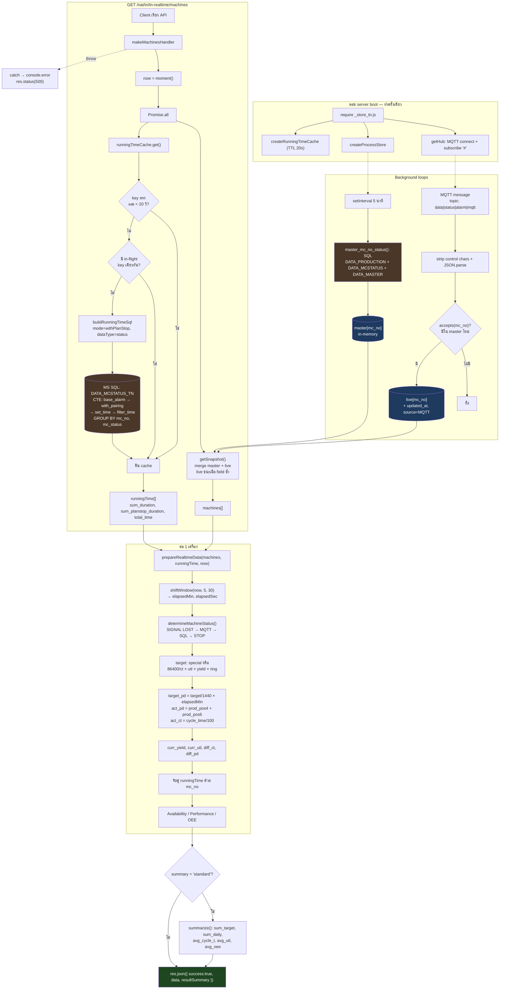

# TN Realtime API — Code Walkthrough

คู่มืออธิบายโค้ดแบบ step-by-step สำหรับ `GET /nat/tn/tn-realtime/machines`
เขียนสำหรับ developer ที่เพิ่งเข้าโปรเจกต์ scope เฉพาะฝั่ง Backend

- **Entry point:** [local-backend/api_nat/tn_tn_realtime.js](../local-backend/api_nat/tn_tn_realtime.js)
- **Mount ที่:** [local-backend/server.js:12](../local-backend/server.js#L12)
- **เอกสารที่เกี่ยวข้อง:** [realtime-developer-guide.md](./realtime-developer-guide.md) §5.4, [field-ownership.md](./field-ownership.md)

---

## 1. ภาพรวม: ไฟล์นี้คืออะไร

`tn_tn_realtime.js` คือ **route file** ตัวหนึ่งใน family ของ realtime API (มี ~17 ไฟล์ pattern เดียวกัน) หน้าที่มีแค่ 2 อย่าง:

1. ประกาศ `GET /nat/tn/tn-realtime/machines`
2. เขียน **business logic การคำนวณ** ของ process TN ลงใน `prepareRealtimeData`

ส่วนงานหนัก — connect DB, connect MQTT, cache, error handling, response shape — ถูกดึงออกไปอยู่ใน util ที่ share กันหมด
นี่คือ Separation of Concerns: **route file = สูตรคำนวณเฉพาะ process, util = machinery**

### ไฟล์ที่เกี่ยวข้อง (BE เท่านั้น)

| ไฟล์ | หน้าที่ |
|---|---|
| [api_nat/_store_tn.js](../local-backend/api_nat/_store_tn.js) | แหล่งข้อมูลของ TN: master จาก SQL + live จาก MQTT + cache running-time |
| [util/processStore.js](../local-backend/util/processStore.js) | in-memory store: merge master(SQL) + live(MQTT) |
| [util/mqttHub.js](../local-backend/util/mqttHub.js) | 1 TCP connection ต่อ 1 broker, fan-out ให้ทุก store |
| [util/mqtt_master_mc_no_status.js](../local-backend/util/mqtt_master_mc_no_status.js) | SQL ดึง master (production ล่าสุด + status ล่าสุด + target) |
| [util/runningTimeCache.js](../local-backend/util/runningTimeCache.js) | TTL cache 20 วินาที + single-flight |
| [util/buildRunningTimeSql.js](../local-backend/util/buildRunningTimeSql.js) | สร้าง SQL คำนวณ duration ต่อ status ในกะ |
| [util/realtimeMachinesRoute.js](../local-backend/util/realtimeMachinesRoute.js) | handler กลาง + summarize + response envelope |
| [util/shiftWindow.js](../local-backend/util/shiftWindow.js) | คำนวณว่ากะเริ่มเมื่อไร ผ่านมากี่นาที/วินาที |
| [util/determineMachineStatus.js](../local-backend/util/determineMachineStatus.js) | ตัดสินสถานะเครื่อง (RUNNING / STOP / SIGNAL LOST) |
| [api_nat/tn_tn_summary.js](../local-backend/api_nat/tn_tn_summary.js) | consumer ที่ reuse `prepareRealtimeData` ตัวเดียวกัน |

---

## 2. Step by step

### Step 0 — ตอน server boot (ทำครั้งเดียว ไม่ใช่ตอนมี request)

`require("./_store_tn")` ทำให้เกิด side effect 3 อย่างทันที:

#### (ก) ต่อ MQTT

[_store_tn.js:24](../local-backend/api_nat/_store_tn.js#L24) — `getHub()` คืน hub ที่ใช้ร่วมกันตาม broker URL ถ้ามีคนต่อ URL นี้แล้วก็ reuse ตัวเดิม
hub subscribe topic `#` ทั้งหมด แล้วแยก topic เป็น `data` / `status` / `alarm` / `mqtt` เก็บสะสมใน `realtimeCache[mc_no]`
([mqttHub.js:87-95](../local-backend/util/mqttHub.js#L87-L95)) ก่อนยิงให้ทุก handler ที่ `accepts(mc_no)` เป็น true

> payload ถูก strip control characters ก่อน `JSON.parse` เพราะ device บางตัวส่ง raw control bytes ปนมาใน string literal ซึ่งผิด RFC 8259

#### (ข) สร้าง store

[processStore.js](../local-backend/util/processStore.js) เก็บ 2 ก้อน **แยกกัน**:

- `master[mc_no]` = แถวจาก SQL, reload ทุก 5 นาที ([processStore.js:108-109](../local-backend/util/processStore.js#L108-L109))
- `live[mc_no]` = ข้อมูล MQTT สะสม ([processStore.js:63-71](../local-backend/util/processStore.js#L63-L71))

จุดสำคัญที่ต้องเข้าใจ:

- `accepts` เช็คว่า `mc_no` มีใน `master` ไหม → **เครื่องที่ยังไม่มีใน SQL master จะไม่รับ MQTT**
- reload master จะลบเครื่องที่หายไปจาก SQL ออกจาก memory ด้วย ([processStore.js:45-51](../local-backend/util/processStore.js#L45-L51)) กัน memory leak
- การ merge คือ `{ ...master, ...live }` → **live ชนะ master เสมอ** ([processStore.js:80-86](../local-backend/util/processStore.js#L80-L86))
  นี่คือ contract ที่ทำให้ค่าจาก MQTT (สดกว่า) override ค่าจาก SQL (เก่ากว่าได้ถึง 5 นาที)

#### (ค) สร้าง running-time cache

[_store_tn.js:33-41](../local-backend/api_nat/_store_tn.js#L33-L41) — TTL 20 วินาที, key = `NAT-TN-<วันที่เริ่มกะ>`
key มีวันที่เริ่มกะอยู่ พอข้ามกะ key เปลี่ยน cache เก่าถูกข้ามอัตโนมัติแม้ TTL ยังไม่หมด

---

### Step 1 — request เข้ามา

`GET /nat/tn/tn-realtime/machines` → handler ที่สร้างจาก `makeMachinesHandler`
([realtimeMachinesRoute.js:62](../local-backend/util/realtimeMachinesRoute.js#L62))

```js
const [machines, runningTime] = await Promise.all([
  Promise.resolve(getMachines()),   // sync — อ่านจาก memory
  getRunningTime(),                 // async — cache หรือ DB
]);
```

`getMachines` เป็น sync (อ่าน RAM) แต่ห่อ `Promise.resolve` เพื่อให้ `Promise.all` รับได้เหมือนกันทั้งคู่
ทำให้ handler ตัวเดียวรองรับได้ทุก route ไม่ว่า source จะ sync หรือ async

---

### Step 2 — running-time (ทางเดียวที่แตะ DB ตอน request)

ถ้า cache หมดอายุ → ยิง SQL ที่ build จาก [buildRunningTimeSql.js](../local-backend/util/buildRunningTimeSql.js)
โดย TN ส่ง `dataType: "status"` → เข้า branch ที่ [buildRunningTimeSql.js:153-194](../local-backend/util/buildRunningTimeSql.js#L153-L194)

Logic ของ SQL คือ **หา duration ของแต่ละ status ในกะ**:

| CTE | ทำอะไร |
|---|---|
| `base_alarm` | ดึง event ในช่วง `กะ − 24 ชม.` ถึง `ตอนนี้ + 2 ชม.` (เผื่อ event คร่อมขอบกะ) |
| `with_pairing` | `LEAD()` หา event ถัดไปของเครื่องเดียวกัน = เวลาสิ้นสุดของ status ปัจจุบัน ถ้าไม่มีตัวถัดไปใช้ `@end_date` (แปลว่าเครื่องยังอยู่ใน status นั้น) |
| `set_time` | clamp ช่วงเวลาให้อยู่ในกรอบกะ |
| `filter_time` | `DATEDIFF(SECOND, ...)` เป็นวินาที |
| final `SELECT` | `GROUP BY mc_no, mc_status` → คืน `sum_duration` (run), `sum_planstop_duration` (plan stop), `total_time` |

**Single-flight:** ถ้ามี 10 request พร้อมกันตอน cache miss จะยิง SQL แค่ครั้งเดียว ที่เหลือรอ Promise ตัวเดิม
([runningTimeCache.js:30](../local-backend/util/runningTimeCache.js#L30))
ถ้า loader reject → เคลียร์ in-flight เพื่อให้ครั้งถัดไป retry ได้

---

### Step 3 — `prepareRealtimeData` — หัวใจการคำนวณ

#### 3.1 กรอบเวลากะ

[tn_tn_realtime.js:20](../local-backend/api_nat/tn_tn_realtime.js#L20)

```js
shiftWindow(now, 5, 30)   // TN เริ่มกะ 05:30
```

ถ้าตอนนี้ 03:00 → ยังอยู่ในกะของ **เมื่อวาน** anchor ถอยไป 1 วัน
([shiftWindow.js:22](../local-backend/util/shiftWindow.js#L22))
นี่คือเหตุผลที่ต้องมี util ตัวนี้ ไม่ใช่แค่ `now.diff(startOfDay)`

`elapsedMin` / `elapsedSec` ถูก clamp ไว้ที่ `>= 0` กัน clock skew

#### 3.2 สถานะเครื่อง

[determineMachineStatus.js](../local-backend/util/determineMachineStatus.js) ทำงานตามลำดับความสำคัญ:

1. `broker === 0` หรือ `updated_at` เก่ากว่า 10 นาที → `SIGNAL LOST`
   (เช็ค connectivity ก่อนเสมอ — ข้อมูลเก่าอันตรายกว่าไม่มีข้อมูล)
2. MQTT status มีคำว่า `RUN` → `RUNNING`
3. ไม่มี MQTT → fallback ไปใช้ status ล่าสุดจาก SQL
4. ไม่เข้าเงื่อนไขไหนเลย → `STOP`

#### 3.3 Target

[tn_tn_realtime.js:25-30](../local-backend/api_nat/tn_tn_realtime.js#L25-L30)

```
target_special > 0  → ใช้ค่านั้นเลย (override โดยคน)
มิฉะนั้น            → floor(86400 / target_ct × utl% × yield% × ring_factor)
```

คือ "จำนวนชิ้นที่ควรผลิตได้ใน 24 ชม." แล้ว pro-rate ตามเวลาที่ผ่านไป:

```js
target_pd = Math.floor(target / (24 * 60) * elapsedMin)
```

#### 3.4 Actual

TN นับผลผลิตจาก 2 ตำแหน่ง: `prod_pos4 + prod_pos6`
(ฟิลด์ชุดนี้เป็นของ TN โดยเฉพาะ ดู [field-ownership.md:100](./field-ownership.md#L100))

`act_ct = cycle_time / 100` เพราะ device ส่งมาเป็นหน่วย 1/100 วินาที

#### 3.5 Utilization

[tn_tn_realtime.js:47-48](../local-backend/api_nat/tn_tn_realtime.js#L47-L48)

```
denom_utl = elapsedSec × ring_factor / target_ct   // ชิ้นที่ทำได้ถ้าเดินเต็ม 100%
curr_utl  = total_pd / denom_utl × 100
```

#### 3.6 OEE

จับคู่แถว running-time ด้วย `mc_no` แล้วคำนวณ:

```
Availability = act_opn_time / (total_work_time − plan_stop) × 100
Performance  = (target_ct × production_count) / (act_opn_time × ring_factor) × 100
Quality      = act_pd / total_pd × 100
OEE          = A × P × Q
```

`|| 0` ท้ายทุกบรรทัดคือกัน `NaN` / `Infinity` ตอนตัวหารเป็น 0 (เครื่องยังไม่เดินเลยในกะ)

---

### Step 4 — Summary + Response

`summary: "standard"` → map field ตาม `SUMMARY_FIELDS.standard`
([realtimeMachinesRoute.js:25](../local-backend/util/realtimeMachinesRoute.js#L25))
แล้ว reduce เป็น `sum_target` / `sum_daily` / `avg_cycle_t` / `avg_utl` / `avg_oee`

Response สำเร็จ:

```json
{
  "success": true,
  "data": [ /* per-machine rows */ ],
  "resultSummary": { "sum_target": 0, "sum_daily": 0, "avg_cycle_t": 0, "avg_utl": 0, "avg_oee": 0 }
}
```

Error → catch ที่ [realtimeMachinesRoute.js:70-73](../local-backend/util/realtimeMachinesRoute.js#L70-L73)
→ `500` `{ success: false, message: "Internal Server Error" }` (ไม่ leak stack ออกไปข้างนอก)

---

### Step 5 — Exports

[tn_tn_realtime.js:95-100](../local-backend/api_nat/tn_tn_realtime.js#L95-L100) export
`prepareRealtimeData` / `getMachineData` / `queryCurrentRunningTime`
ให้ [tn_tn_summary.js](../local-backend/api_nat/tn_tn_summary.js) reuse
— สูตรคำนวณเขียนที่เดียว ใช้ได้ 2 endpoint

---

## 3. Flow chart (DB → Response)



---

## 4. Key takeaways

1. **DB ถูกแตะน้อยมากตอน request** — master โหลดล่วงหน้าไว้ใน memory, running-time cache 20 วินาที
   request ปกติ = อ่าน RAM ล้วน
2. **แยก ownership ของ field ด้วย storage ไม่ใช่ allowlist** — master กับ live เก็บคนละ object แล้วค่อย merge ตอนอ่าน
   ทำให้ไม่มีใครเผลอเขียนทับกัน
3. **Cache key ต้องมี business boundary อยู่ในนั้น** — ใส่วันที่เริ่มกะใน key ทำให้ข้ามกะแล้ว cache bust เอง
   ไม่ต้องมี logic invalidate แยก
4. **Handler กลาง + logic เฉพาะ process** — เพิ่ม process ใหม่ = เขียนแค่ `prepareRealtimeData` + `_store_*.js`

---

## 5. Known issues / TODO

รายการที่พบตอนรีวิวโค้ด **ยังไม่ได้แก้** — บันทึกไว้ให้ทีมตัดสินใจ

| # | ไฟล์ | ประเด็น |
|---|---|---|
| 1 | [tn_tn_realtime.js:6-7](../local-backend/api_nat/tn_tn_realtime.js#L6-L7) | **Doc drift** — header บอกว่าใช้ `mode:"runOnly"` และไม่มี `sum_planshutdown_duration` แต่จริงๆ [_store_tn.js:37](../local-backend/api_nat/_store_tn.js#L37) ใช้ `mode:"withPlanStop", dataType:"status"` และโค้ดอ่าน `sum_planstop_duration` ปกติ |
| 2 | [tn_tn_realtime.js:51](../local-backend/api_nat/tn_tn_realtime.js#L51) | **`.find()` เจอแถวเดียว แต่ SQL คืน 2 แถวต่อเครื่อง** — `GROUP BY mc_no, mc_status` คืนทั้งแถว `run` และ `plan stop` แยกกัน แต่ละแถวมีอีกคอลัมน์เป็น 0 `.find()` หยิบแถวแรกเท่านั้น → ถ้าแถวแรกเป็น `run` จะได้ `plan_stop = 0` ตลอด (Availability สูงเกินจริง) ถ้าแถวแรกเป็น `plan stop` จะได้ `act_opn_time = 0` (OEE = 0) ควรเปลี่ยนเป็น `.filter()` แล้ว sum ทั้งสองคอลัมน์ |
| 3 | [tn_tn_realtime.js:36](../local-backend/api_nat/tn_tn_realtime.js#L36) | **`ng_pd` hardcode 0** — ทำให้ `curr_yield` = 100% เสมอเมื่อมีการผลิต Quality ใน OEE จึงไม่มีความหมายจริง |
| 4 | [realtimeMachinesRoute.js:37](../local-backend/util/realtimeMachinesRoute.js#L37) | **`avg_oee` คำนวณแบบคูณสะสม** — `total_oee *= oee/100` คือคูณ OEE ทุกเครื่องเข้าด้วยกัน ไม่ใช่ค่าเฉลี่ย มี 10 เครื่อง เครื่องละ 80% จะได้ ~0.01% ตั้งใจแบบนี้จริงหรือ? |
| 5 | [tn_tn_realtime.js:35](../local-backend/api_nat/tn_tn_realtime.js#L35) | **`drop` คำนวณแล้วไม่ถูกใช้ในสูตรใด** — ส่งออก response อย่างเดียว ไม่ถูกหักออกจาก `total_pd` |
| 6 | [buildRunningTimeSql.js:165](../local-backend/util/buildRunningTimeSql.js#L165) | **SQL string interpolation** — `CONDITION` ต่อสตริงตรงๆ ตอนนี้ TN ไม่ได้ส่งมา แต่เป็น injection surface ถ้าวันหน้ามีใครส่งค่าจาก user เข้ามา |
